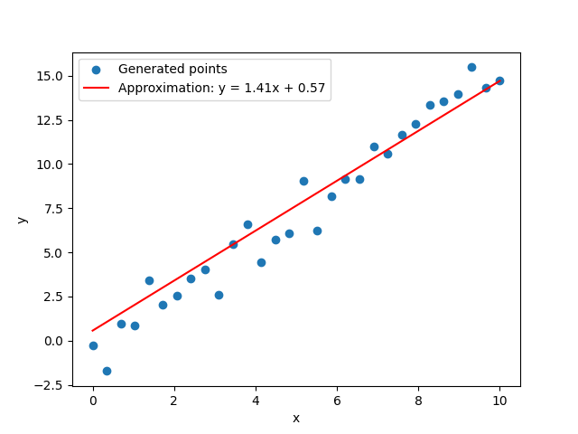
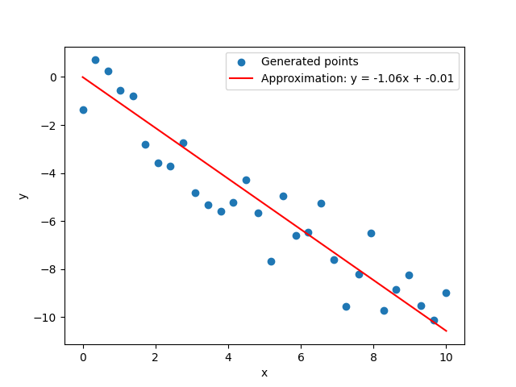

# Linear regression with neural networks
This repository contains a simple implementation of linear regression using the perceptron learning algorithm. The goal of the project is to demonstrate how the perceptron algorithm can be used to approximate a linear relationship between input features (x) and output labels (y).

## Key Components:
**Perceptron Training**: The `train_perceptron` function implements the perceptron learning algorithm to iteratively adjust weights (a and b) in order to minimize the mean squared error between predicted and actual values.

**Data Generation**: The `generate_points` function creates dataset with a linear relationship between x and y, introducing some random noise to simulate real-world scenarios.

**Visualization**: The `generate_plot` function uses Matplotlib to visualize the generated dataset along with the linear approximation produced by the trained perceptron.

## Dependencies:
**Matplotlib**
```
python -m pip install -U matplotlib
```

**NumPy**
```
pip install numpy
```

## How to Run:
1. Clone the repository.
2. Install dependencies.
3. Run the script (python main.py) to see the perceptron in action.

## Screenshots




